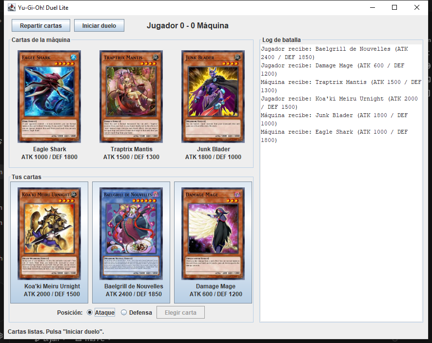
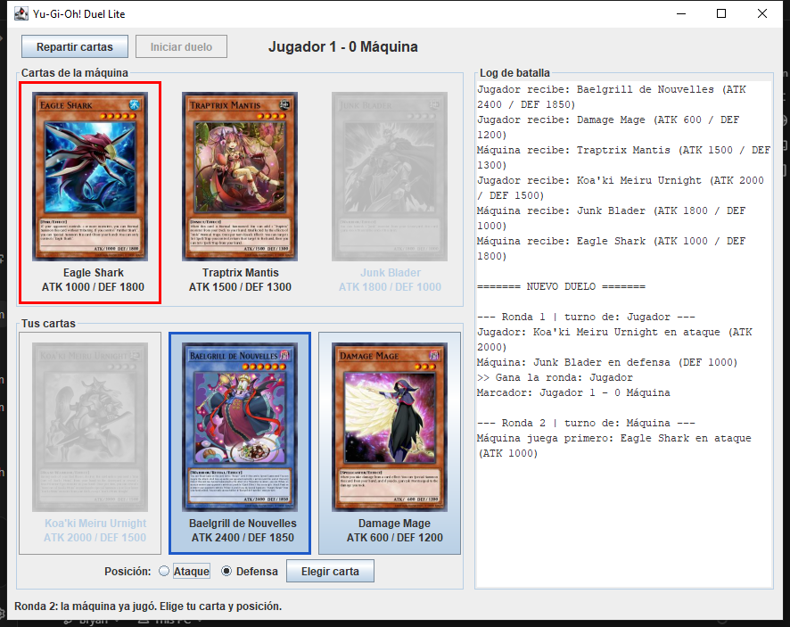
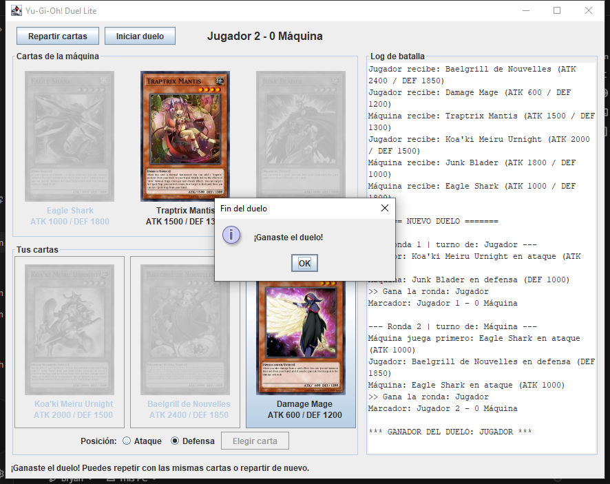
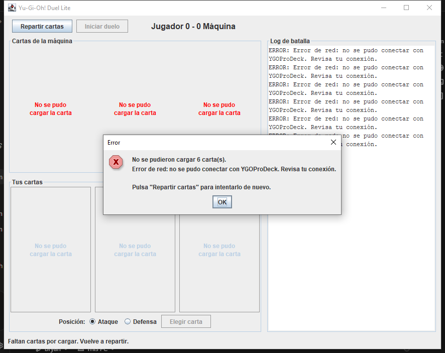

# Yu-Gi-Oh! Duel Lite

Mini-aplicación de escritorio en **Java Swing** que simula un duelo sencillo de Yu-Gi-Oh! entre el jugador y la máquina, usando cartas obtenidas en vivo desde la API [YGOProDeck](https://ygoprodeck.com/api-guide/).

- **Programa:** Ingenieria en Sistemas
- **Materia:** Desarrollo de Software III
- **Docente:** Mg(c). Juan Pablo Pinillos Reina

## Integrantes

- Bryan Steven Panesso Avila
- Andres Felipe Castrillon

## Funcionalidades

- Al abrir la aplicación se reparten 3 cartas Monster aleatorias a cada jugador (`randomcard.php`). Si la API devuelve una Spell/Trap (o una Link, que no tiene DEF) se vuelve a pedir.
- Cada carta muestra su imagen oficial, nombre, ATK y DEF.
- **Iniciar duelo** solo se habilita cuando las 6 cartas están cargadas.
- El jugador selecciona una carta, elige la posición (**Ataque** o **Defensa**) y pulsa **Elegir carta**. La máquina elige carta y posición al azar.
- Log de batalla desplazable con las cartas jugadas, el resultado de cada ronda y el marcador.
- Anuncio del ganador al llegar a 2 rondas ganadas.
- Errores visibles sin congelar la interfaz ("No se pudo cargar la carta", "Error de red"). Con **Repartir cartas** se vuelve a intentar o se juega con cartas nuevas.

## Requisitos

- Java 17 o superior (JDK).
- Maven (o IntelliJ IDEA, que ya lo trae).
- Conexión a internet.

La única dependencia externa es `org.json`, que Maven descarga solo.

## Ejecución

### Opción 1: IntelliJ IDEA

1. `File > Open...` y seleccionar la carpeta del proyecto (la que tiene el `pom.xml`).
2. Esperar a que Maven descargue las dependencias.
3. Ejecutar `src/main/java/vista/DuelLiteApp.java` (método `main`).

### Opción 2: Línea de comandos

Desde la carpeta raíz del proyecto:

```bash
mvn compile exec:java
```

## Estructura

```
src/main/java/
├── modelo/Card.java              # Modelo: nombre, ATK, DEF y URL de la imagen
├── red/YgoApiClient.java         # HttpClient + parseo JSON (org.json), validación de Monster
├── logica/Duel.java              # Reglas del duelo: turnos, comparación, puntaje
├── logica/BattleListener.java    # Eventos del duelo: onRoundStart, onTurn, onScoreChanged, onDuelEnded
└── vista/DuelLiteApp.java        # Interfaz Swing (JFrame) que implementa BattleListener
```

## Diseño

El proyecto separa responsabilidades en paquetes. `modelo.Card` solo guarda los datos de la carta. `red.YgoApiClient` consulta `randomcard.php` con `java.net.http.HttpClient`, parsea la respuesta con `org.json` y repite la petición hasta obtener una carta Monster con ATK y DEF; también descarga la imagen y convierte los fallos en mensajes claros ("Error de red", "No se pudo cargar la carta"). `logica.Duel` contiene las reglas del enfrentamiento y no conoce Swing: todo lo que pasa lo informa a través de la interfaz `BattleListener`, de modo que la lógica podría usarse con otra interfaz o probarse por separado.

`vista.DuelLiteApp` construye la ventana, registra los `ActionListener` de **Repartir cartas**, **Iniciar duelo** y **Elegir carta**, e implementa `BattleListener` para actualizar el log, el marcador y las cartas usadas. Cada una de las 6 cartas se descarga en su propio `SwingWorker`, así las peticiones HTTP y la descarga/escalado de imágenes nunca bloquean el Event Dispatch Thread y las cartas van apareciendo a medida que llegan. Mientras se cargan, los botones que podrían dejar el juego en un estado inconsistente quedan deshabilitados.

## Reglas del duelo

- Cada jugador tiene 3 cartas y cada carta se usa una sola vez.
- El turno inicial se sortea y luego se alterna en cada ronda. Quien tiene el turno juega primero: si es la máquina, su carta se muestra (marcada en rojo) antes de que el jugador elija.
- Comparación:
  - **Ambos en ataque:** gana el mayor ATK.
  - **Uno en ataque y otro en defensa:** ATK del atacante contra DEF del defensor. El atacante tiene que superar la DEF; si empata, la defensa aguanta y gana el defensor.
  - **Ambos en defensa:** nadie ataca, gana la mayor DEF.
- En cada ronda siempre hay un único ganador: si hay empate en ataque contra ataque o defensa contra defensa, gana quien tenía el turno.
- El primero en ganar 2 rondas gana el duelo.

## Capturas de pantalla

**Cartas repartidas**



**Ronda en curso** (la máquina tiene el turno y ya mostró su carta)



**Fin del duelo**



**Manejo de errores** (sin conexión)


